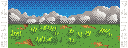
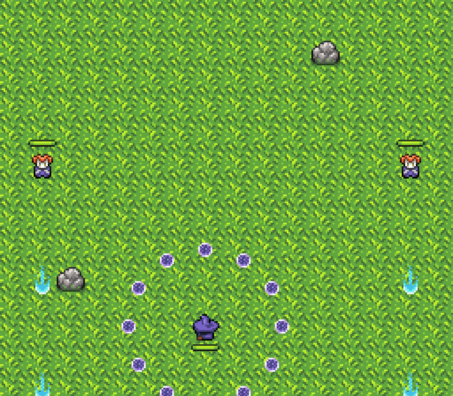
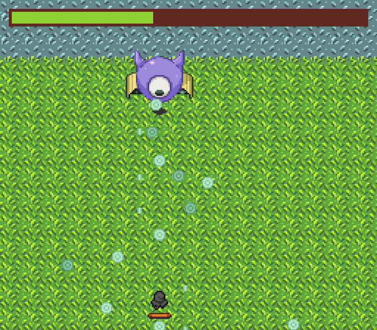
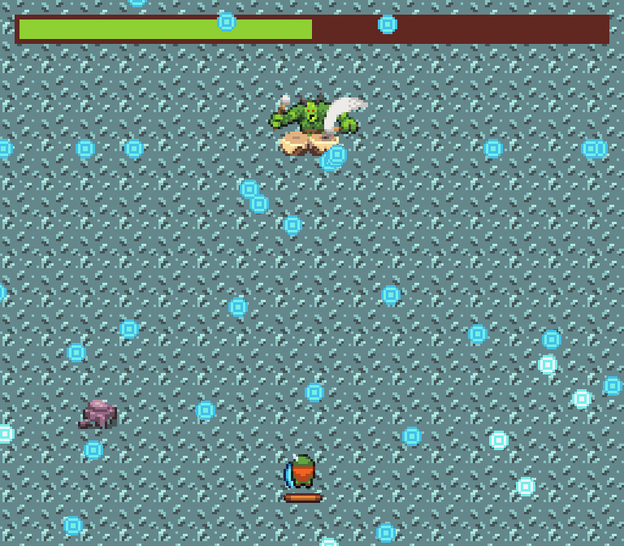

 

  

  <h3>Marnis Legend</h3>

  

    The kingdom of Marnis has been taken over by beings from the alternate dimension! Can the heroes of Marnis protect the kingdom?
  

  
  
  

## Running Locally
1. Make sure you are in the root directory of this project.
    - You should be able to see the index.html file.
1. In a command line, run `yarn` to install the required node modules.
1. Run `yarn dev` to start the development server.
1. You should get a link (default: `http://localhost:5173`) you can connect to to start playing locally.

(<a href="#readme-top">Back to top</a>)
